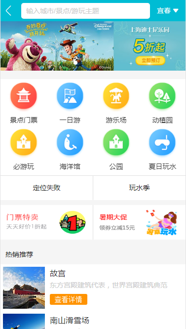
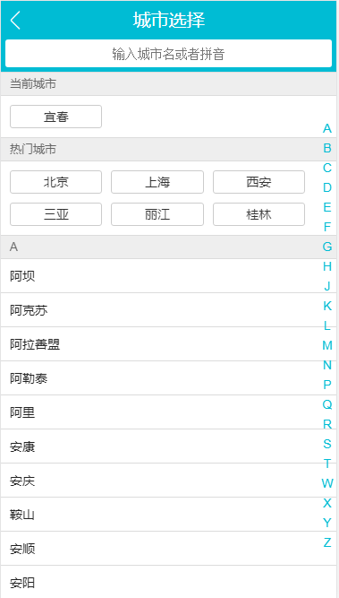
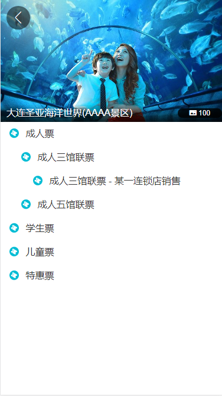
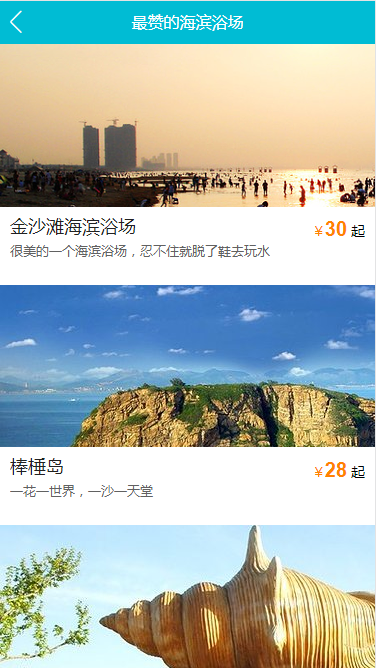

# vue.js模仿旅游网App

## 说明：
   这是一个用vue2.0实现的一个旅游网App,数据使用mock进行模拟，
	 
## 项目结构
  |——— build  #webpack编译相关文件目录，一般不需要动
	|——— config  #配置环境变量
	|    |——— dev.env.js #开发环境变量
	|		 |——— index.js   #主配置文件
	|    |——— prod.js    #生产环境变量
	|——— node_modules #一些常用安装的依赖
	|——— src #前端项目源码目录
	|    |——— assets  #资源目录
	|		 |——— common  #公用文件目录
	|    |——— pages   #组件以及页面文件目录
	|    |——— router  #路由目录
	|    |——— store   #数据状态管理
	|    |——— App.vue #项目入口文件
	|    |——— main.js #项目核心文件
	|——— static       #开发模式下静态资源目录
	|——— index.html   #首页入口文件，你可以添加一些 meta 信息或同统计代码啥的
	|——— package.json #项目配置文件
	|___ README.md    #项目的说明文档，markdown 格式
	
	
## 相关技术
	1. vuejs2.0：一套构建用户界面的渐进式框架，易用、灵活、高效。
	2. vue-router：官方的路由组件，配合vue.js创建单页应用（SPA）非常简单。
	3. axios: 基于 Promise 的 HTTP 请求客户端，可同时在浏览器和 node.js 中使用。
	4. vue-awesome-swiper: 基于 Swiper3、适用于 Vue 的轮播组件，支持服务端渲染和单页应用。
	5. fastclick: 解决移动端点击延迟方案
	6. stylus: css样式解析，语法
	7. better-scroll: 移动滚动插件

## 项目编译和运行
    1. 可以直接在git上下载项目源码。把github下载到本地，
	git clone git@github.com:MrZHLF/tourism.git
	2. 进入到tourism目录，进行初始化，安装依赖
		npm run dev
	3. 依赖安装成功后执行启动命令
	   npm run dev
	   如果显示一下内容说明安装成功
	   I  Your application is running here: http://localhost:8080
		 
		 
## 常见引入第三方
	在main.js中引入
	import 'styles/reset.css'  //重置css样式
	import 'styles/border.css'  //解决移动端1像素问题
	import 'styles/iconfont.css' //引入阿里图标
	修改别名
	在 webpack.base.conf.js 修改别名 'styles': resolve('src/assets/styles') 
	在相应的目录直接用 @import '~styles/varibles.styl'来引入需要的文件
	
## 成果展示

